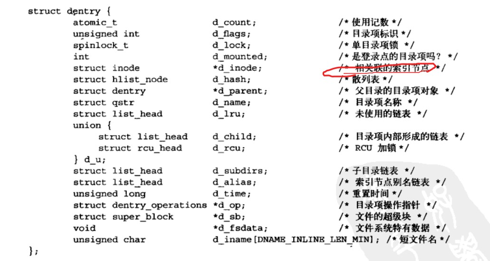

超级块部分：

​	

```C
static struct super_operations revofs_super_ops = {
    // 卸载文件系统时释放超级块
    .put_super = revofs_put_super,  
    // 给定超级块下创建和初始化一个新的索引节点对象
    .alloc_inode = revofs_alloc_inode,
    // 释放给定的索引节点
    .destroy_inode = revofs_destroy_inode,
    // 用于将给定的索引节点写入磁盘，wait参数指明写操作是否需要同步
    .write_inode = revofs_write_inode,
    // 同步文件系统数据
    .sync_fs = revofs_sync_fs,
    // 获取文件系统状态，相关统计信息放置在statfs中
    .statfs = revofs_statfs,
    // 用给定的超级块更新磁盘上的超级块
    .write_super(struct super_block *);
};
```


```c
struct super_block{
    s_op //超级块方法  super_operations
    s_maxbytes  // ull 文件大小上限
    s_magic //文件系统幻数
    s_fs_info  // void* 文件系统特殊类型 可以将超级块信息统一存放于此，比如说位图，块数，大小，空闲块数等 用结构体封装
    s_root //struct dentry 目录挂载点
    
    
    
}
```


位图：


```c
static __always_inline void bitmap_set(unsigned long *map, unsigned int start,
		unsigned int nbits)
{
	if (__builtin_constant_p(nbits) && nbits == 1)
		__set_bit(start, map);
	else if (__builtin_constant_p(start & BITMAP_MEM_MASK) &&
		 IS_ALIGNED(start, BITMAP_MEM_ALIGNMENT) &&
		 __builtin_constant_p(nbits & BITMAP_MEM_MASK) &&
		 IS_ALIGNED(nbits, BITMAP_MEM_ALIGNMENT))
		memset((char *)map + start / 8, 0xff, nbits / 8);
	else
		__bitmap_set(map, start, nbits);
}

static __always_inline void bitmap_clear(unsigned long *map, unsigned int start,
		unsigned int nbits)
{
	if (__builtin_constant_p(nbits) && nbits == 1)
		__clear_bit(start, map);
	else if (__builtin_constant_p(start & BITMAP_MEM_MASK) &&
		 IS_ALIGNED(start, BITMAP_MEM_ALIGNMENT) &&
		 __builtin_constant_p(nbits & BITMAP_MEM_MASK) &&
		 IS_ALIGNED(nbits, BITMAP_MEM_ALIGNMENT))
		memset((char *)map + start / 8, 0, nbits / 8);
	else
		__bitmap_clear(map, start, nbits);
}

// include/linux/types.h
#define DECLARE_BITMAP(name,bits) \
	unsigned long name[BITS_TO_LONGS(bits)]

 // file: include/linux/bitops.h  位图操作函数定义处
 // 将nr bit 转为 long类型
#define BITS_TO_LONGS(nr)   DIV_ROUND_UP(nr, BITS_PER_BYTE * sizeof(long))

// file: include/linux/kernel.h
#define DIV_ROUND_UP(n,d) (((n) + (d) - 1) / (d))
```


__set_bit: 

```c
static inline void __set_bit(int nr, volatile unsigned long *addr)
 {
     asm volatile("bts %1,%0" : ADDR : "Ir" (nr) : "memory");
 }
```

​	nr - 待设置的比特位位置

​	addr - 位图的起始地址


set_bit:

```c
// 或运算
static __always_inline void
 set_bit(unsigned int nr, volatile unsigned long *addr)
 {
     if (IS_IMMEDIATE(nr)) {
         asm volatile(LOCK_PREFIX "orb %1,%0"
             : CONST_MASK_ADDR(nr, addr)
             : "iq" ((u8)CONST_MASK(nr))
             : "memory");
     } else {
         asm volatile(LOCK_PREFIX "bts %1,%0"
             : BITOP_ADDR(addr) : "Ir" (nr) : "memory");
     }
 }

// file: arch/x86/include/asm/bitops.h
  #define IS_IMMEDIATE(nr)        (__builtin_constant_p(nr))


// file: arch/x86/include/asm/bitops.h
// 获取nr bit位对应的是哪个字节，以此获取字节基地址
// BITOP_ADDR可以将字节基地址转为volatile long类型
  #define CONST_MASK_ADDR(nr, addr)   BITOP_ADDR((void *)(addr) + ((nr)>>3))
// 获取对应的是一个字节中的哪个bit
  #define CONST_MASK(nr)          (1 << ((nr) & 7))
```


__clear_bit:

```c
// file: arch/x86/include/asm/bitops.h
 static inline void __clear_bit(int nr, volatile unsigned long *addr)
 {
     asm volatile("btr %1,%0" : ADDR : "Ir" (nr));
 }

//btr 指令接收 2 个参数：位偏移以及位图基地址。该指令会将位图中指定偏移处的比特位设置为 0，并把原比特位的值保存到 EFLAGS 寄存器的 CF 标志位中。
```


```c
// 与运算
static __always_inline void
 clear_bit(int nr, volatile unsigned long *addr)
 {
     if (IS_IMMEDIATE(nr)) {
         asm volatile(LOCK_PREFIX "andb %1,%0"
             : CONST_MASK_ADDR(nr, addr)
             : "iq" ((u8)~CONST_MASK(nr)));
     } else {
         asm volatile(LOCK_PREFIX "btr %1,%0"
             : BITOP_ADDR(addr)
             : "Ir" (nr));
     }
 }
```


__change_bit:

位取反函数

```c
// file: arch/x86/include/asm/bitops.h 
static inline void __change_bit(int nr, volatile unsigned long *addr)
 {
     asm volatile("btc %1,%0" : ADDR : "Ir" (nr));
 }
// btc 指令会将位图中指定偏移处的比特位取反
```


change_bit:

```c
// 位取反函数
static inline void change_bit(int nr, volatile unsigned long *addr)
 {
     if (IS_IMMEDIATE(nr)) {
         asm volatile(LOCK_PREFIX "xorb %1,%0"
             : CONST_MASK_ADDR(nr, addr)
             : "iq" ((u8)CONST_MASK(nr)));
     } else {
         asm volatile(LOCK_PREFIX "btc %1,%0"
             : BITOP_ADDR(addr)
             : "Ir" (nr));
     }
 }
```


test_bit: (位测试)

```c
// file: arch/x86/include/asm/bitops.h
 #define test_bit(nr, addr)          \
     (__builtin_constant_p((nr))     \
      ? constant_test_bit((nr), (addr))  \
      : variable_test_bit((nr), (addr)))

// file: arch/x86/include/asm/bitops.h
// 与操作
 static __always_inline int constant_test_bit(unsigned int nr, const volatile unsigned long *addr)
 {
     return ((1UL << (nr % BITS_PER_LONG)) &
         (addr[nr / BITS_PER_LONG])) != 0;
 }

// file: arch/x86/include/asm/bitops.h
 static inline int variable_test_bit(int nr, volatile const unsigned long *addr)
 {
     int oldbit;
     asm volatile("bt %2,%1\n\t"
              "sbb %0,%0"
              : "=r" (oldbit)
              : "m" (*(unsigned long *)addr), "Ir" (nr));
     return oldbit;
 }
```


bitmap_zero:

```c
// include/linux/bitmap.h
// dst : 起始位置
// nbits : 位图的比特位数量
static inline void bitmap_zero(unsigned long *dst, unsigned int nbits)
{
    // 字节数 向上取整 可能会超出限制
	unsigned int len = BITS_TO_LONGS(nbits) * sizeof(unsigned long);
    // 置0
	memset(dst, 0, len);
}
```


bitmap_fill:

```c
static inline void bitmap_fill(unsigned long *dst, unsigned int nbits)
{
	unsigned int len = BITS_TO_LONGS(nbits) * sizeof(unsigned long);
	memset(dst, 0xff, len);
}
```

与bitmap_zero图示一样，只不过0换为1


find_first_bit: 查找位图内第一个被设置1的比特位。

addr - 位图的起始地址

size - 位图的搜索范围 0 ~ size - 1

```c
// file: lib/find_bit.c

#ifndef find_first_bit
/*
 * Find the first set bit in a memory region.
 */
unsigned long _find_first_bit(const unsigned long *addr, unsigned long size)
{
	unsigned long idx;

	for (idx = 0; idx * BITS_PER_LONG < size; idx++) {
		if (addr[idx])
			return min(idx * BITS_PER_LONG + __ffs(addr[idx]), size);
	}

	return size;
}
EXPORT_SYMBOL(_find_first_bit);
#endif


// arch/x86/include/asm/bitops.h
static __always_inline unsigned long __ffs(unsigned long word)
{
	asm("rep; bsf %1,%0"
		: "=r" (word)
		: "rm" (word));
	return word;
}
// rep 指令从源操作数中搜索最低的设置为1的位
```


find_first_zero_bit:

```c
#ifndef find_first_zero_bit
/*
 * Find the first cleared bit in a memory region.
 */
unsigned long _find_first_zero_bit(const unsigned long *addr, unsigned long size)
{
	unsigned long idx;
	for (idx = 0; idx * BITS_PER_LONG < size; idx++) {
		if (addr[idx] != ~0UL)
			return min(idx * BITS_PER_LONG + ffz(addr[idx]), size);
	}

	return size;
}
EXPORT_SYMBOL(_find_first_zero_bit);
#endif

// 该指令会从源操作数中搜索最低位的设置为 1 的位。如果找到，该位的索引会保存在目标操作数中
static __always_inline unsigned long ffz(unsigned long word)
{
	asm("rep; bsf %1,%0"
		: "=r" (word)
		: "r" (~word));
	return word;
}
```


`include/linux/bitops.h`中的四个宏：

1. for_each_set_bit:  从位图的起始地址开始，迭代查找为1的位；
2. for_each_set_bit_from: 从位图的指定位置开始，迭代查找为1的位；
3. for_each_clear_bit：从位图起始位置开始，迭代查找为0的位；
4. for_each_clear_bit_from：从位图指定位置开始，迭代查找其中为0的位。

特殊的转换：

```c
// include/linux/bitops.h
#define BITS_PER_TYPE(type)	(sizeof(type) * BITS_PER_BYTE)
#define BITS_TO_LONGS(nr)	__KERNEL_DIV_ROUND_UP(nr, BITS_PER_TYPE(long))
#define BITS_TO_U64(nr)		__KERNEL_DIV_ROUND_UP(nr, BITS_PER_TYPE(u64))
#define BITS_TO_U32(nr)		__KERNEL_DIV_ROUND_UP(nr, BITS_PER_TYPE(u32))
#define BITS_TO_BYTES(nr)	__KERNEL_DIV_ROUND_UP(nr, BITS_PER_TYPE(char))
```


## 具体文件编写内容

### super.c

主要用于超级块相关操作函数编写


