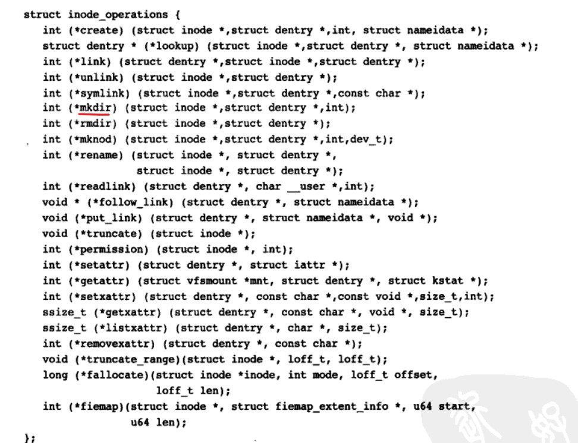
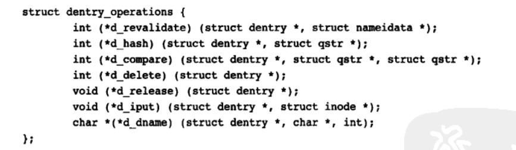
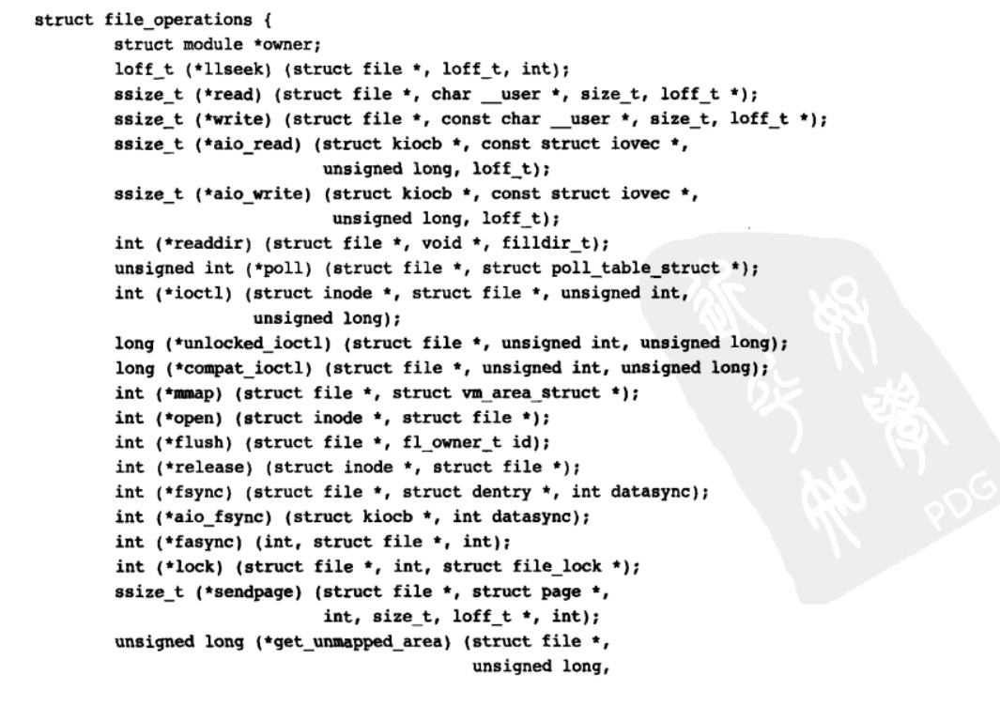

超级块部分：

​	

```C
static struct super_operations revofs_super_ops = {
    // 卸载文件系统时释放超级块
    .put_super = revofs_put_super,  
    // 给定超级块下创建和初始化一个新的索引节点对象
    .alloc_inode = revofs_alloc_inode,
    // 释放给定的索引节点
    .destroy_inode = revofs_destroy_inode,
    // 用于将给定的索引节点写入磁盘，wait参数指明写操作是否需要同步
    .write_inode = revofs_write_inode,
    // 同步文件系统数据
    .sync_fs = revofs_sync_fs,
    // 获取文件系统状态，相关统计信息放置在statfs中
    .statfs = revofs_statfs,
    // 用给定的超级块更新磁盘上的超级块
    .write_super(struct super_block *);
};
```


```c
struct super_block{
    s_op //超级块方法  super_operations
    s_maxbytes  //ull 文件大小上限
    s_magic //文件系统幻数
    s_fs_info  // void* 文件系统特殊类型 可以将超级块信息统一存放于此，比如说位图，块数，大小，空闲块数等 用结构体封装
    s_root //struct dentry 目录挂载点
    
    
}
```


位图：

```c
static __always_inline void bitmap_set(unsigned long *map, unsigned int start,
		unsigned int nbits)
{
	if (__builtin_constant_p(nbits) && nbits == 1)
		__set_bit(start, map);
	else if (__builtin_constant_p(start & BITMAP_MEM_MASK) &&
		 IS_ALIGNED(start, BITMAP_MEM_ALIGNMENT) &&
		 __builtin_constant_p(nbits & BITMAP_MEM_MASK) &&
		 IS_ALIGNED(nbits, BITMAP_MEM_ALIGNMENT))
		memset((char *)map + start / 8, 0xff, nbits / 8);
	else
		__bitmap_set(map, start, nbits);
}

static __always_inline void bitmap_clear(unsigned long *map, unsigned int start,
		unsigned int nbits)
{
	if (__builtin_constant_p(nbits) && nbits == 1)
		__clear_bit(start, map);
	else if (__builtin_constant_p(start & BITMAP_MEM_MASK) &&
		 IS_ALIGNED(start, BITMAP_MEM_ALIGNMENT) &&
		 __builtin_constant_p(nbits & BITMAP_MEM_MASK) &&
		 IS_ALIGNED(nbits, BITMAP_MEM_ALIGNMENT))
		memset((char *)map + start / 8, 0, nbits / 8);
	else
		__bitmap_clear(map, start, nbits);
}

// include/linux/types.h
#define DECLARE_BITMAP(name,bits) \
	unsigned long name[BITS_TO_LONGS(bits)]

 // file: include/linux/bitops.h
  #define BITS_TO_LONGS(nr)   DIV_ROUND_UP(nr, BITS_PER_BYTE * sizeof(long))
```

