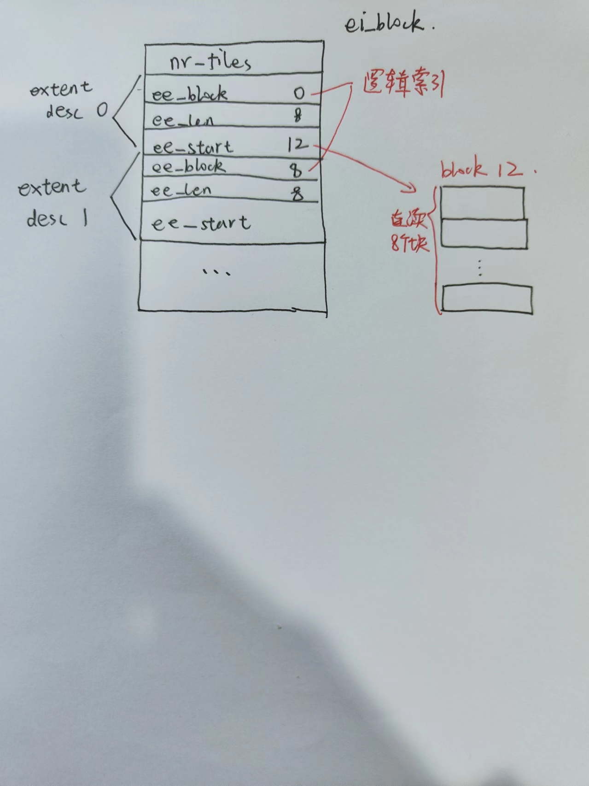

# 总流程分析及项目开发

## revofs

### 总的磁盘布局结构

| super | inode_store | inode_bitmap | block_bitmap | blocks  data |
| ----- | ----------- | ------------ | ------------ | ------------ |

### super block 超级块

超级块磁盘布局：

| magic                  |
| ---------------------- |
| **nr_blocks**          |
| **nr_inodes**          |
| **nr_istore_blocks**   |
| **nr_ifree_blocks**    |
| **nr_bfree_blocks**    |
| **nr_free_inodes**     |
| **nr_free_blocks**     |
| **char padding[4064]** |

前面的共占8*4 = 32字节，然后填充4064字节刚好占一个磁盘块


超级块内存布局：

在挂载时通过revofs_fill_super函数来填充内存的超级块对象**struct super_block *sb**，首先磁盘中超级块的数据会读入一个**revofs_sb_info**结构体中，这个结构体仅仅是比磁盘中的数据布局多了两个freemap，只需要将freemap的内容读磁盘进行填充即可。


然后把这个结构体接在sb->s_fs_info中即可。

此外对**sb**的其他填充涉及到如下字段：

- s_magic 文件系统幻数
- s_blocksize 一个磁盘块的字节大小
- s_maxbytes  文件大小上限
- s_op 即super_operations


### inode 索引块

inode**磁盘**布局：

```c
struct revofs_inode {
    uint32_t i_mode;   /* File mode */ //dir link file
    uint32_t i_uid;    /* Owner id */
    uint32_t i_gid;    /* Group id */
    uint32_t i_size;   /* Size in bytes */
    uint32_t i_ctime;  /* Inode change time */
    uint32_t i_atime;  /* Access time */
    uint32_t i_mtime;  /* Modification time */
    uint32_t i_blocks; /* Block count */
    uint32_t i_nlink;  /* Hard links count */
    uint32_t ei_block;  /* Block with list of extents for this file */
    char i_data[32]; /* store symlink content */
};
```

磁盘布局与上述结构体中的数据类似，一个磁盘块中有多个inode。


inode**内存**布局：

从磁盘中我们读取的inode在内存中进行了两次封装，一种是封装为linux中自带的inode结构体，接着会对linux自带的inode结构体进行进一步封装为revofs_inode_info结构。

```c
struct revofs_inode_info {
    uint32_t ei_block;  /* Block with list of extents for this file */
    char i_data[32];
    struct inode vfs_inode;
};// 对linux中自带的inode填充后进一步封装为revofs_inode_info结构体
```


#### 从磁盘读入到内存中具体的填充字段

inode.c中的revofs_iget函数作用即为从磁盘中获取ino对应的inode，并在内存中进行封装。

```c
...
    cinode = (struct revofs_inode *) bh->b_data;
    cinode += inode_shift;

    inode->i_ino = ino;
    inode->i_sb = sb;
    inode->i_op = &revofs_inode_ops;
    // change to main machine
    inode->i_mode = le32_to_cpu(cinode->i_mode);
    // usr id
    i_uid_write(inode, le32_to_cpu(cinode->i_uid));
    // group id
    i_gid_write(inode, le32_to_cpu(cinode->i_gid));
    inode->i_size = le32_to_cpu(cinode->i_size);
    inode->i_ctime.tv_sec = (time64_t) le32_to_cpu(cinode->i_ctime);
    inode->i_ctime.tv_nsec = 0;
    inode->i_atime.tv_sec = (time64_t) le32_to_cpu(cinode->i_atime);
    inode->i_atime.tv_nsec = 0;
    inode->i_mtime.tv_sec = (time64_t) le32_to_cpu(cinode->i_mtime);
    inode->i_mtime.tv_nsec = 0;
    inode->i_blocks = le32_to_cpu(cinode->i_blocks);
    set_nlink(inode, le32_to_cpu(cinode->i_nlink));

    // i_fop 缺省的索引节点操作 file_operation
    if (S_ISDIR(inode->i_mode)) {
        ci->ei_block = le32_to_cpu(cinode->ei_block);
        inode->i_fop = &revofs_dir_ops;
    } else if (S_ISREG(inode->i_mode)) {
        ci->ei_block = le32_to_cpu(cinode->ei_block);
        inode->i_fop = &revofs_file_ops;
        inode->i_mapping->a_ops = &revofs_aops;
    } else if (S_ISLNK(inode->i_mode)) {
        strncpy(ci->i_data, cinode->i_data, sizeof(ci->i_data));
        inode->i_link = ci->i_data;
        inode->i_op = &symlink_inode_ops;
    }
...
```

从上述可以看出从磁盘块读取的inode内容首先由bufferhead bh接收，并将其转化为结构体类型，然后通过此revofs_inode结构对inode中的以下字段进行了赋值：

- i_ino inode块号
- i_sb 内存超级块结构
- i_op 对应的inode_operations 注意如果是符号连接的话需要将其替换为专门编写的符号连接操作
- i_mode 标识此文件是什么类型：
  - DIR
  - REG FILE
  - SLINK
- i_size 以字节为单位的文件大小
- i_ctime 最后改变时间
- i_atime 最后访问时间
- i_mtime 最后修改时间
- i_blocks 文件的所占磁盘块数
- i_nlink 硬链接数
- i_fop 根据上述i_mode选取对应的file_operations进行赋值
- i_mapping->a_ops 涉及到页缓存的操作
- i_link 符号连接的符号


此外此inode所属的revofs_inode_info填充ei_block，表示其扩展块号是哪个。如果inode的i_mode标识它是一个符号连接的话，还得对其i_data进行赋值


#### 磁盘中inode索引文件的逻辑

前面对磁盘中的inode结构进行了分析说明，如下：

```c
struct revofs_inode {
    uint32_t i_mode;   /* File mode */ //dir link file
    uint32_t i_uid;    /* Owner id */
    uint32_t i_gid;    /* Group id */
    uint32_t i_size;   /* Size in bytes */
    uint32_t i_ctime;  /* Inode change time */
    uint32_t i_atime;  /* Access time */
    uint32_t i_mtime;  /* Modification time */
    uint32_t i_blocks; /* Block count */
    uint32_t i_nlink;  /* Hard links count */
    uint32_t ei_block;  /* Block with list of extents for this file */
    char i_data[32]; /* store symlink content */
};
```

其中**ei_block**是扩展块号，其中扩展块的结构如下：

| nr_files                                      |
| --------------------------------------------- |
| **revofs_extent extents[REVOFS_MAX_EXTENTS]** |

```c
struct revofs_extent {
    uint32_t ee_block; /* first logical block extent covers */ // one extent first logical
    uint32_t ee_len;   /* number of blocks covered by extent */
    uint32_t ee_start; /* first physical block extent covers */
};
```

其中revofs_extent的结构如上，`ee_block`表示的是本extent区域开头的逻辑块号，`ee_len`标识本extent区域的所占磁盘块的数目，本文件系统默认一个extent是八个磁盘块，`ee_start`是本extent区域开头的真实物理块号。


为啥需要extent区域：可以实现大文件的创建和操作分配，因为extent区域表示的是连续的八个磁盘块的空间，可以实现大文件的创建，并且由于是连续的提高了磁盘访问效率。




#### 磁盘block中存储的目录项结构

| inode number     |
| ---------------- |
| **filename**     |
| **inode number** |
| **filename**     |
| ...              |


### 文件系统总逻辑

#### 文件系统注册

```c
//fs/filesystems.c
// 内核中已经注册了的文件系统串联的链表
static struct file_system_type *file_systems;

int register_filesystem(struct file_system_type * fs)
{
	int res = 0;
	struct file_system_type ** p;

	if (fs->parameters &&
	    !fs_validate_description(fs->name, fs->parameters))
		return -EINVAL;

	BUG_ON(strchr(fs->name, '.'));
	if (fs->next)
		return -EBUSY;
	write_lock(&file_systems_lock);
	p = find_filesystem(fs->name, strlen(fs->name));
	if (*p)
		res = -EBUSY;
	else
		*p = fs;
	write_unlock(&file_systems_lock);
	return res;
}
```

内核中文件系统的注册其实很简单，就是将自己写好的file_system_type结构加入到内核维护的相关链表中。当我们注册一个文件系统时，会依据文件系统的名字来查看链表中是否存在，如果存在就不再重复注册，否则会加入到链表末尾。


#### 格式化磁盘

将磁盘格式化为我们文件系统的总体磁盘布局结构，这个时候便需要我们编写格式化程序。revofs中便是在mkfs.c中实现了格式化磁盘，在main函数中，主要是以下步骤：

1. 用open系统调用打开设备文件，然后准备执行写操作；
2. 在内存中封装好写入磁盘的超级快内容，写超级块；
3. 写inode_store。这里只对第0个inode进行了初始化，表示其是根目录，并且对其ei_block块号分配为第一个数据块；
4. 写inode_bitmap。这里只将第0个inode的置为0，表示使用。其余的全部为未使用；
5. 写blocks_bitmap。在这里明显我们首先计算已经使用过的磁盘块，明显是super，inode_store,inode_bitmap,block_bitmap，还有root inode的ei_block。这些我们都要初始化为使用，即置0；
6. 对数据块无操作。


#### 挂载 mount

挂载操作的最后其实就是调用的file_system_type中的mount函数。

如果我们在命令行输入这么一段话：

**sudo mount -t revofs /dev/loop7 /mnt/test**

那么revofs便是我们的挂载的文件系统类型，/dev/loop7为挂载的设备名，/mnt/test为挂载点。一旦执行触发系统调用：

```c
// fs/namespace.c
SYSCALL_DEFINE5(mount, char __user *, dev_name, char __user *, dir_name,
		char __user *, type, unsigned long, flags, void __user *, data)
{
	int ret;
	char *kernel_type;
	char *kernel_dev;
	void *options;
	// 拷贝文件系统类型名到内核空间
	kernel_type = copy_mount_string(type);
	ret = PTR_ERR(kernel_type);
	if (IS_ERR(kernel_type))
		goto out_type;
	// 挂载设备路径名拷贝
	kernel_dev = copy_mount_string(dev_name);
	ret = PTR_ERR(kernel_dev);
	if (IS_ERR(kernel_dev))
		goto out_dev;
	// 挂载选项拷贝
	options = copy_mount_options(data);
	ret = PTR_ERR(options);
	if (IS_ERR(options))
		goto out_data;
	// 开启挂载 dir_name是挂载点目录
	ret = do_mount(kernel_dev, dir_name, kernel_type, flags, options);

	kfree(options);
out_data:
	kfree(kernel_dev);
out_dev:
	kfree(kernel_type);
out_type:
	return ret;
}
```

接下来进入do_mount函数


```c
// include/linux/path.c
struct path {
	struct vfsmount *mnt;
	struct dentry *dentry; //挂载点dentry实例
} __randomize_layout;

long do_mount(const char *dev_name, const char __user *dir_name,
		const char *type_page, unsigned long flags, void *data_page)
{
	struct path path;
	int ret;
	// 把挂载点解析成path路径结构
	ret = user_path_at(AT_FDCWD, dir_name, LOOKUP_FOLLOW, &path);
	if (ret)
		return ret;
	ret = path_mount(dev_name, &path, type_page, flags, data_page);
	path_put(&path);
	return ret;
}

// path_mount中最后调用核心是do_new_mount
static int do_new_mount(struct path *path, const char *fstype, int sb_flags,
			int mnt_flags, const char *name, void *data)
{
	struct file_system_type *type;
	struct fs_context *fc;
	const char *subtype = NULL;
	int err = 0;

	if (!fstype)
		return -EINVAL;
	// 由文件系统名获取file_system_type实例
	type = get_fs_type(fstype);
	if (!type)
		return -ENODEV;

	if (type->fs_flags & FS_HAS_SUBTYPE) {
		subtype = strchr(fstype, '.');
		if (subtype) {
			subtype++;
			if (!*subtype) {
				put_filesystem(type);
				return -EINVAL;
			}
		}
	}
	// 创建fs_context结构体
	fc = fs_context_for_mount(type, sb_flags);
	put_filesystem(type);
	if (IS_ERR(fc))
		return PTR_ERR(fc);

	if (subtype)
		err = vfs_parse_fs_string(fc, "subtype",
					  subtype, strlen(subtype));
	if (!err && name)
		err = vfs_parse_fs_string(fc, "source", name, strlen(name));
	if (!err)
		err = parse_monolithic_mount_data(fc, data);
	if (!err && !mount_capable(fc))
		err = -EPERM;
	if (!err)
		err = vfs_get_tree(fc);
	if (!err)
        // 执行新的挂载
		err = do_new_mount_fc(fc, path, mnt_flags);

	put_fs_context(fc);
	return err;
}

// do_new_mount_fc
static int do_new_mount_fc(struct fs_context *fc, struct path *mountpoint,
			   unsigned int mnt_flags)
{
	struct vfsmount *mnt;
	......
	// 由fs_context创建vfsmount
	mnt = vfs_create_mount(fc);
	
	......
	error = do_add_mount(real_mount(mnt), mp, mountpoint, mnt_flags);
	......
	return error;
}
```


现在比较vfsmount和fs_context的结构：

```c
struct fs_context {
......
    struct dentry		*root;		/* The root and superblock */
......
};

struct vfsmount {
    struct dentry *mnt_root;	/* root of the mounted tree */
    struct super_block *mnt_sb;	/* pointer to superblock */
    int mnt_flags;
} __randomize_layout;

// mount结构 每个挂载的文件系统都会创建
struct mount {
	struct hlist_node mnt_hash;
	struct mount *mnt_parent;
	struct dentry *mnt_mountpoint;
	struct vfsmount mnt;
	union {
		struct rcu_head mnt_rcu;
		struct llist_node mnt_llist;
	};
...
    
	struct list_head mnt_mounts;	/* list of children, anchored here */
	struct list_head mnt_child;	/* and going through their mnt_child */
	struct list_head mnt_instance;	/* mount instance on sb->s_mounts */
	const char *mnt_devname;	/* Name of device e.g. /dev/dsk/hda1 */
	struct list_head mnt_list;
    
...
} __randomize_layout;

// fs/mount.h 表示根文件系统中的挂载点
struct mountpoint {
	struct hlist_node m_hash;  // 添加至全局hash散列表
	struct dentry *m_dentry;	//挂载点dentry实例指针
	struct hlist_head m_list;
	int m_count;  //挂载点挂载操作的次数
};
```

每个挂载的文件系统都会创建**mount**结构来表示挂载的信息，在**vfs_create_mount**函数中，会创建mount结构，然后依据fs_context来对mount结构信息进行填充并且对vfsmnt结构进行初始化和填充。这样最后其实mount结构体便和文件系统建立了联系。


继续对上述do_new_mount函数分析：

1. **type = get_fs_type(fstype)**。根据`fstype`找到对应的`file_system_type`结构体；

2. **fc = fs_context_for_mount(type, sb_flags)**。这里面，会调用文件系统自定义的init_fs_context回调； 如果没有定义fc->fs_type->init_fs_context， 则会调用**legacy_init_fs_context**初始化, 这里fc->ops = &legacy_fs_context_ops， 其中legacy_get_tree会调用fc->fs_type->mount；

   ```c
   const struct fs_context_operations legacy_fs_context_ops = {
   	.free			= legacy_fs_context_free,
   	.dup			= legacy_fs_context_dup,
   	.parse_param		= legacy_parse_param,
   	.parse_monolithic	= legacy_parse_monolithic,
   	.get_tree		= legacy_get_tree,
   	.reconfigure		= legacy_reconfigure,
   };
   ```

   

3. 调用`vfs_get_tree`，这里面会调用**fc->ops->get_tree**。如果按照上述调用，那么会调用**legacy_get_tree**函数，里面会调用我们自己写的mount函数，在我们自己写的mount函数中

   ```c
   static int legacy_get_tree(struct fs_context *fc)
   {
   	struct legacy_fs_context *ctx = fc->fs_private;
   	struct super_block *sb;
   	struct dentry *root;
   
   	root = fc->fs_type->mount(fc->fs_type, fc->sb_flags,
   				      fc->source, ctx->legacy_data);
   	if (IS_ERR(root))
   		return PTR_ERR(root);
   	// 获取超级块
   	sb = root->d_sb;
   	BUG_ON(!sb);
   	// 获取根目录
   	fc->root = root;
   	return 0;
   }
   ```

   

4. 

